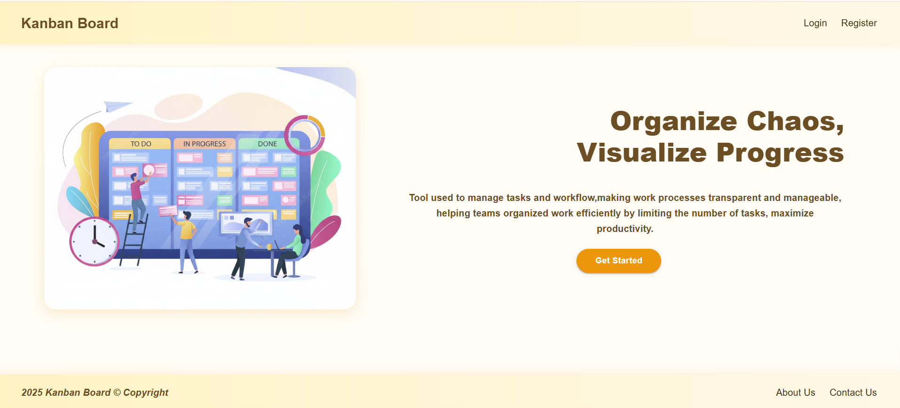
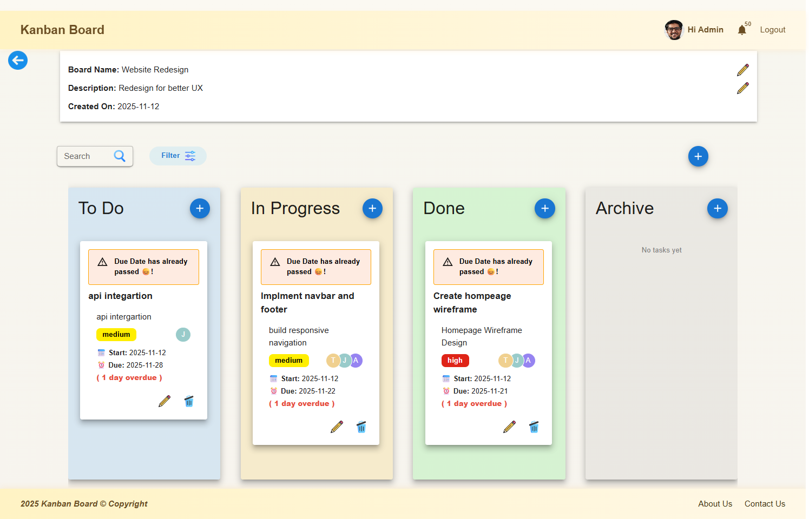
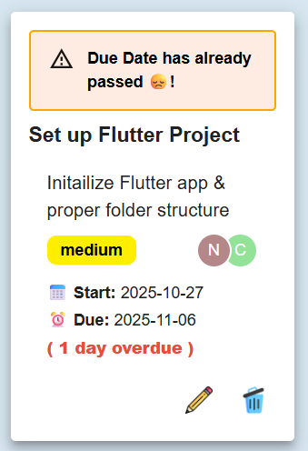
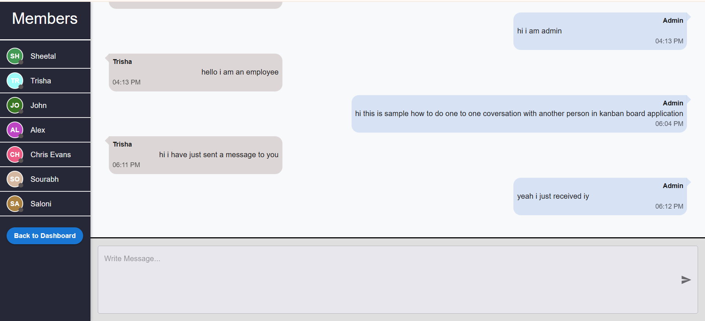
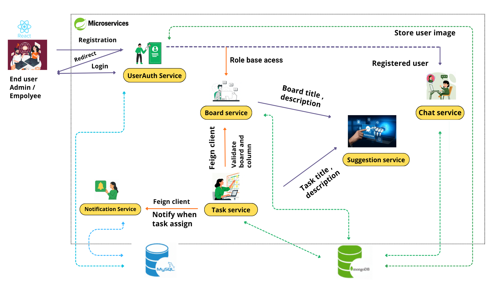

## Kanban Board

A role-based task management and workflow optimization platform built using microservices arhitecture.
It allows teams to create, assign, and track tasks visually using a Kanban board, imporving collaboration, productivity and project visibility.

The system includes real-time updates, analytics (pie & bar charts), chat functionality, and AI-powered task assistance.

  
## 🧩 Features
- Role based access control (Admin / Employee)
- Task creation, assignment and tracking
- AI-powered Task Assistant 
- Real-time chat system
- JWT based authentication
- Microservices architecture
- Responsive UI using React

## ❗Problem Statement

Many teams struggle with inefficient task tracking, lack of real-time visbility and poor communication.
Traditional tools often fail to provide a clear workflow structure, leading to delays and reduced productivity. 

## 💡Solution

This system improves workflow visibility and team collaboration through real-time updates, role-based access, chat functionality and analytics dashboards.

## 🛠️ Tech Stack
- Frontend: React, Material UI
- Backend: Spring Boot (Microservices)
- Databases: MySQL, MongoDB
- Authentication: JWT
- AI Integration: Gemini API

## ⚙️ How the application works
1. Users register/login using JWT authentication
2. Role based access is applied (Admin / Employee)
3. Admin can create boards and assign tasks
4. Employee update task status (To Do → In Progress → Done)
5. Tasks are visualized using Kanban board
6. Chat system enables communication
7. AI Assistant helps generate task content
8. Microservices handle different modules independently

## ▶️ How to Run the Project
### Pre-requisites 
    Java 17+, Node.js, MongoDB, MySQL, Maven
### Steps
1. Clone the repository
2. Start backend service: mvn spring-boot:run
3. Start Frontend: npm install , then npm start
4. Open in browser: http://localhost:3000

## 📸 Output Screenshots
### Home Page

### Board Dashboard (Admin View)

### Task Board 

### Chat System

## 🏗️ Architecture Diagram

## 🎥 Project Demo
Watch here: https://youtu.be/D7Hubh9FUaI

## ⚡ Challenges I Faced
- Managing microservices communication
- Implementing secure JWT authentication
- Integrating AI (Gemini API)
- Building real-time chat using WebSockets
- Debugging distributed system issues

## 🚀 Future Improvements

- AI-based task prioritization and time estimation
- Real-time notifications for task updates and deadlines
- Advanced analytics dashboards
- Private chat channels
- Full WebSocket based updates
